# Приложение для управления элементами сайта стоматологической клиники

Административное SPA-приложение для управления контентом сайта стоматологической клиники. Работает как дополнение к CMS MODX Revolution и взаимодействует с REST API бэкенда (ZoomX API Controllers).

Приложение доступно администратору сайта по адресу `/app/...` (например, `http://sitename.com/app/examples`). Доступ возможен только после авторизации в MODX — без активной сессии система возвращает 404.

## Содержание

- [Требования](#требования)
- [Установка и запуск](#установка-и-запуск)
- [Переменные окружения](#переменные-окружения)
- [Структура проекта](#структура-проекта)
- [Стек технологий](#стек-технологий)
- [Маршруты](#маршруты)
- [Функционал](#функционал)
  - [Прайс-лист](#прайс-лист)
  - [Примеры работ](#примеры-работ)
  - [Отзывы](#отзывы)
- [Скриншоты](#скриншоты)
- [Взаимодействие с API](#взаимодействие-с-api)
- [Особенности реализации](#особенности-реализации)
- [Сборка и деплой](#сборка-и-деплой)
- [Changelog](#changelog)
- [Лицензия](#лицензия)

## Требования

- Node.js 20+
- npm 10+
- Запущенный бэкенд MODX с API (см. `ZoomX API Controllers`)

## Установка и запуск

```bash
# Установка зависимостей
npm install

# Запуск в режиме разработки (Vite dev server, порт 5173)
npm run dev

# Сборка production-версии
npm run build

# Предпросмотр production-сборки
npm run preview

# Линтинг
npm run lint
```

В dev-режиме приложение доступно по адресу `http://localhost:5173`.
Vite проксирует запросы `/api` и `/assets` на бэкенд, указанный в переменной `VITE_SITE_URL`.

## Переменные окружения

Создайте файл `.env` и `.env.production` в корне проекта:

```env
VITE_SITE_URL=http://sitename.com
VITE_APP_ENV=development
VITE_API_URL=/api
```

```env.production
VITE_APP_ROOT=/app
VITE_APP_ENV=production
VITE_API_URL=/api
```

| Переменная     | Описание                                                      |
|----------------|---------------------------------------------------------------|
| `VITE_SITE_URL`| URL бэкенда MODX (используется для проксирования `/api` и `/assets`) |
| `VITE_APP_ENV` | Окружение (`development` / `production`). В production задаёт `base: '/app'` |
| `VITE_API_URL` | Алиас для `/api`, используется для проксирования |
| `VITE_APP_ROOT` | Алиас базового пути для запуска приложения из CMS |

## Структура проекта

Проект построен по методологии **Feature-Sliced Design (FSD)**:

```
app/
├── public/
├── src/
│   ├── app/            # Инициализация приложения, роутинг, провайдеры, глобальные стили
│   ├── entities/       # Бизнес-сущности (pricelist, example, testimonial, dept)
│   ├── features/       # Фичи (создание, редактирование, удаление, поиск, пагинация)
│   ├── pages/          # Страницы приложения (price, examples, testimonials)
│   ├── shared/         # Переиспользуемый код (UI-кит, api-клиент, утилиты, конфиг)
│   ├── widgets/        # Составные блоки (таблицы данных)
│   └── main.tsx        # Точка входа
├── assets/
├── index.html
├── package.json
├── tsconfig.json
├── vite.config.ts
└── eslint.config.js
```

**Слои FSD:**

- **app** — инициализация, роутер, глобальные провайдеры, стили.
- **pages** — композиция виджетов и фич для конкретного маршрута.
- **widgets** — самостоятельные блоки интерфейса (таблицы данных).
- **features** — пользовательские сценарии (создание, редактирование, удаление, выбор изображений, поиск, пагинация).
- **entities** — бизнес-сущности с моделью данных и API-запросами.
- **shared** — UI-кит, HTTP-клиент, утилиты, конфигурация.

## Стек технологий

| Технология      | Версия    | Назначение                            |
|-----------------|-----------|---------------------------------------|
| React           | ^19.2.7   | UI-библиотека                         |
| React DOM       | ^19.2.7   | Рендеринг                             |
| React Router    | ^8.1.0    | Клиентский роутинг                    |
| Zustand         | ^5.0.14   | Управление состоянием                 |
| TypeScript      | ~6.0.2    | Типизация                             |
| Vite            | ^8.1.1    | Сборщик и dev-server                  |
| ESLint          | ^10.6.0   | Линтинг                               |
| PostCSS         | —         | Custom media queries, глобальные данные |

**UI-библиотеки не используются.** Все компоненты реализованы вручную с применением CSS-модулей.

**HTTP-клиент:** нативный `fetch`.

**Тесты:** не предусмотрены.

## Маршруты

Приложение использует клиентский роутинг (React Router). Базовый путь в production — `/app`.

| Маршрут                | Компонент          | Описание                                  |
|------------------------|--------------------|-------------------------------------------|
| `/app/price`           | `PricePage`        | CRUD-операции со списком цен (прайс-лист) |
| `/app/examples`        | `ExamplesPage`     | CRUD-операции со списком примеров работ   |
| `/app/testimonials`    | `TestimonialsPage` | CRUD-операции со списком отзывов          |

Переключение между разделами доступно через табы в шапке страницы: **Прайс-лист**, **Примеры работ**, **Отзывы**.

## Функционал

### Общие элементы интерфейса

На всех страницах присутствуют:

- **Шапка** с названием раздела и кнопкой **«Назад в CMS»** (возврат в CMS MODX).
- **Поиск** — глобальное поле поиска в шапке.
- **Табы** для переключения между разделами.
- **Кнопка «Обновить»** — перезагрузка данных с сервера.
- **Кнопка «Добавить»** — открывает модальное окно создания записи.
- **Пагинация** внизу таблицы (например, «Показано 1–10 из 39»).
- **Действия над записью** — кнопки «Редактировать» (карандаш) и «Удалить» (корзина).
- **Тосты / уведомления** — для информирования об успехе или ошибке операции.

---

### Прайс-лист

**Маршрут:** `/app/price`

Таблица позиций прайс-листа.

**Колонки:**

| Колонка          | Описание                                     |
|------------------|----------------------------------------------|
| Наименование     | Название услуги                              |
| Цена, ₽          | Цена (с префиксом «от», если `isMinValue = 1`) |
| Отделение        | Название отделения (ссылка на страницу сайта) |
| Скрыто           | Да / Нет (флаг `is_hidden`)                  |
| Дата создания    | Дата создания записи                         |
| Дата изменения   | Дата последнего изменения                    |
| Действия         | Кнопки редактирования и удаления             |

**Создание / редактирование:**

Модальное окно содержит поля:

- **Наименование** — текстовое поле.
- **Цена, ₽** — числовое поле.
- **Отделение** — выпадающий список.
- **Скрыто** — чекбокс.
- **Минимальная цена** — чекбокс (соответствует `isMinValue`).

**Удаление:**

Модальное окно с подтверждением: «Вы действительно хотите удалить "Название"?" и кнопками **Да** / **Нет**.

---

### Примеры работ

**Маршрут:** `/app/examples`

Таблица примеров работ (кейсов).

**Колонки:**

| Колонка          | Описание                                     |
|------------------|----------------------------------------------|
| Наименование     | Превью изображения «ДО» + название (например, «Пациент 45 лет») и описание под ним |
| Скрыто           | Да / Нет (флаг `is_hidden`)                  |
| Специалист       | ФИО врача (ссылка на страницу сайта)         |
| Отделение        | Название отделения (ссылка на страницу сайта) |
| Дата создания    | Дата создания записи                         |
| Дата изменения   | Дата последнего изменения                    |
| Действия         | Кнопки редактирования и удаления             |

**Создание / редактирование:**

Модальное окно содержит поля:

- **Наименование** — текстовое поле (например, «Пациент 45 лет»).
- **Описание** — многострочное текстовое поле.
- **Специалист** — выпадающий список врачей.
- **Отделение** — выпадающий список отделений.
- **Скрыто** — чекбокс.

**Выбор изображений:**

По клику на превью работы открывается модальное окно **«Выберите изображения»** со списком доступных изображений из галереи.

- В шапке отображается текущая запись (название + описание) и два превью-слота: **До** и **После**.
- Список изображений подгружается из галереи (`/api/pictures`) с пагинацией.
- Каждая карточка содержит превью, имя файла, дату загрузки, размер и разрешение.
- Выбранное изображение подсвечивается цветом в зависимости от выбора слота:
  - **До** — красный (выбран).
  - **После** — серый (по умолчанию).
- Внизу модального окна — пагинация («Показано 1–20 из 50») и кнопки **Сохранить** / **Закрыть**.

**Удаление:**

Модальное окно с подтверждением и кнопками **Да** / **Нет**.

---

### Отзывы

**Маршрут:** `/app/testimonials`

Таблица отзывов пациентов.

**Колонки:**

| Колонка          | Описание                                     |
|------------------|----------------------------------------------|
| Имя              | Имя автора отзыва + текст отзыва под ним     |
| Оценка           | Число от 1 до 5                              |
| Скрыто           | Да / Нет (флаг `is_hidden`)                  |
| Специалист       | ФИО врача (если указан, ссылка на страницу сайта) |
| Дата создания    | Дата создания записи                         |
| Дата изменения   | Дата последнего изменения                    |
| Действия         | Кнопки редактирования и удаления             |

**Создание / редактирование:**

Модальное окно содержит поля:

- **Имя** — текстовое поле.
- **Оценка** — числовое поле (1–5).
- **Описание** — многострочное текстовое поле.
- **Специалист** — выпадающий список врачей.
- **Скрыто** — чекбокс.

**Удаление:**

Модальное окно с подтверждением и кнопками **Да** / **Нет**.

## Скриншоты

Все изображения хранятся в директории `docs/screenshots/`.

### Прайс-лист

**Список позиций:** `/app/price`

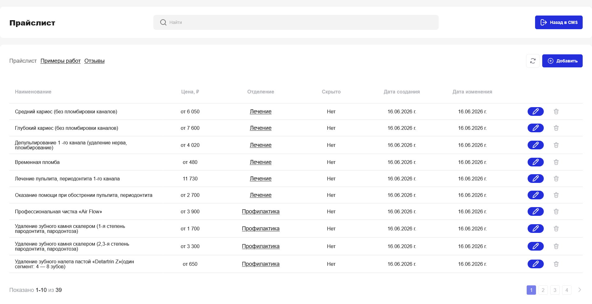

Таблица позиций с колонками: наименование, цена, отделение, скрыто, даты создания и изменения. Внизу — пагинация («Показано 1–10 из 39»).

**Создание позиции:**

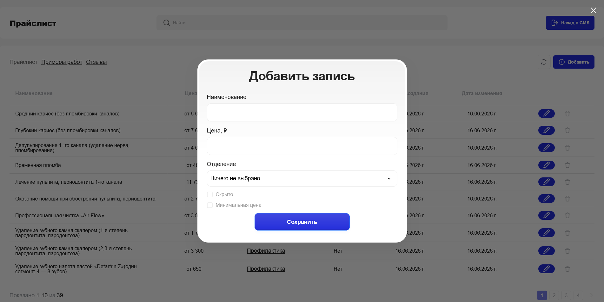

Модальное окно «Добавить запись» с полями: наименование, цена, отделение (выпадающий список), чекбоксы «Скрыто» и «Минимальная цена».

**Редактирование позиции:**

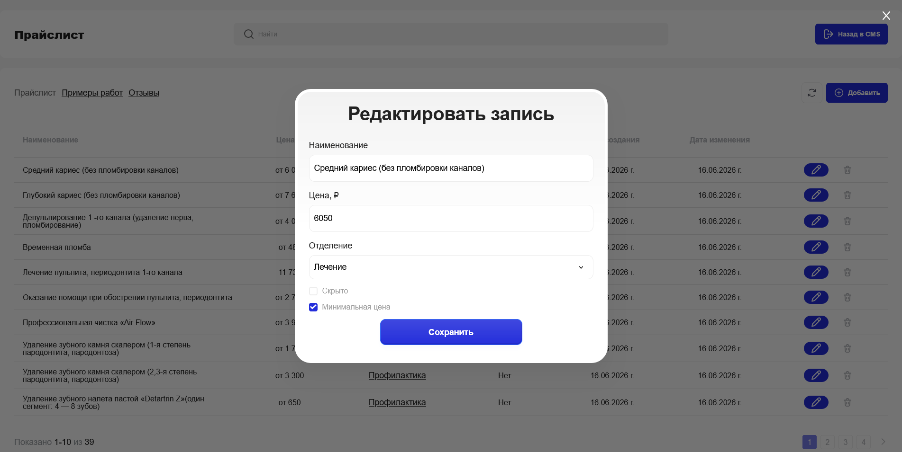

Модальное окно «Редактировать запись» с заполненными полями. Чекбокс «Минимальная цена» отмечен для позиций с префиксом «от».

**Удаление позиции:**

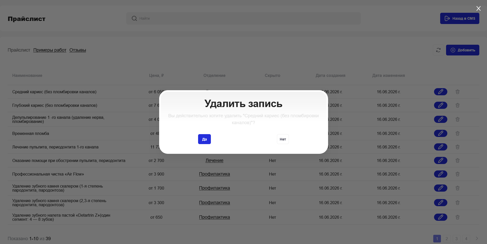

Модальное окно подтверждения: «Вы действительно хотите удалить "Название"?" с кнопками **Да** / **Нет**.

---

### Примеры работ

**Список примеров:** `/app/examples`

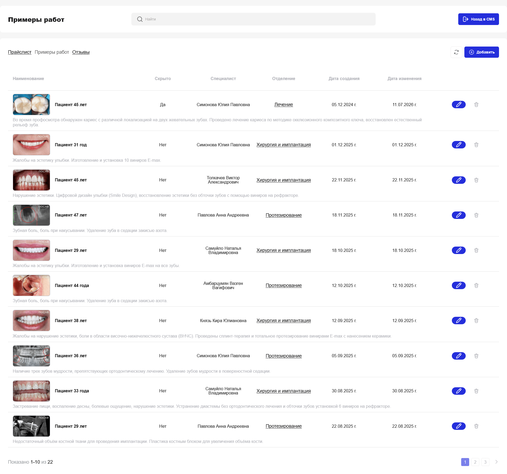

Таблица примеров с превью изображения «ДО», названием (например, «Пациент 45 лет»), описанием, специалистом, отделением и датами.

**Создание примера:**

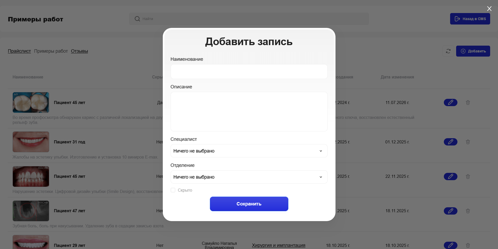

Модальное окно «Добавить запись» с полями: наименование, описание, специалист (выпадающий список), отделение (выпадающий список), чекбокс «Скрыто».

**Редактирование примера:**

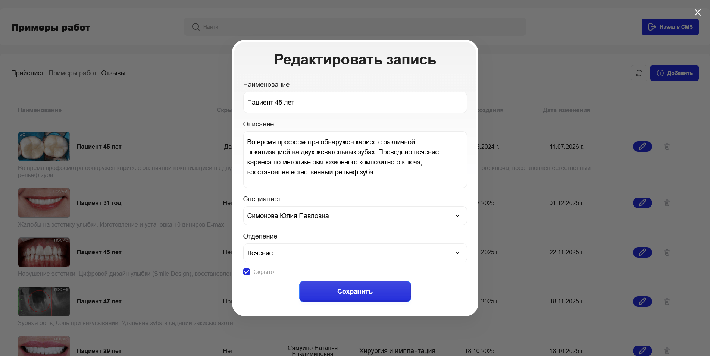

Модальное окно «Редактировать запись» с заполненными полями, включая описание кейса и выбранного специалиста.

**Выбор изображений из галереи:**

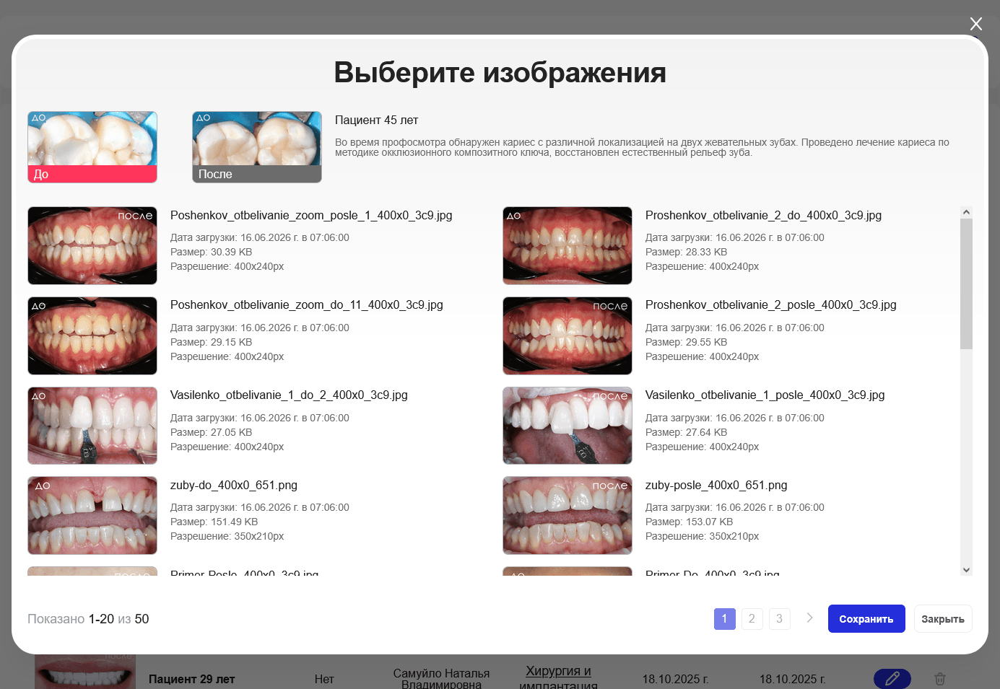

Модальное окно «Выберите изображения» с двумя превью-слотами (активный — красный, по умолчанию — серый) и сеткой доступных изображений из галереи. Каждая карточка содержит превью, имя файла, дату загрузки, размер и разрешение. Внизу — пагинация («Показано 1–20 из 50») и кнопки **Сохранить** / **Закрыть**.

**Удаление примера:**

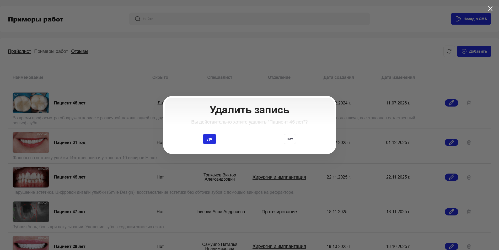

Модальное окно подтверждения с названием удаляемой записи и кнопками **Да** / **Нет**.

---

### Отзывы

**Список отзывов:** `/app/testimonials`

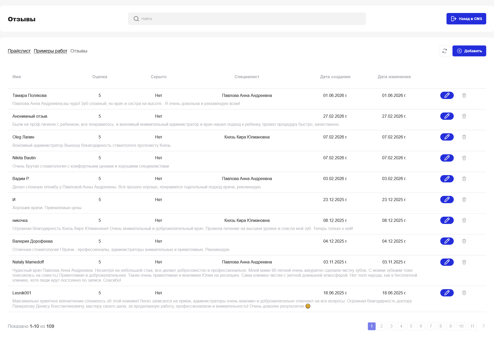

Таблица отзывов с колонками: имя автора (+ текст отзыва), оценка, скрыто, специалист, даты создания и изменения.

**Создание отзыва:**

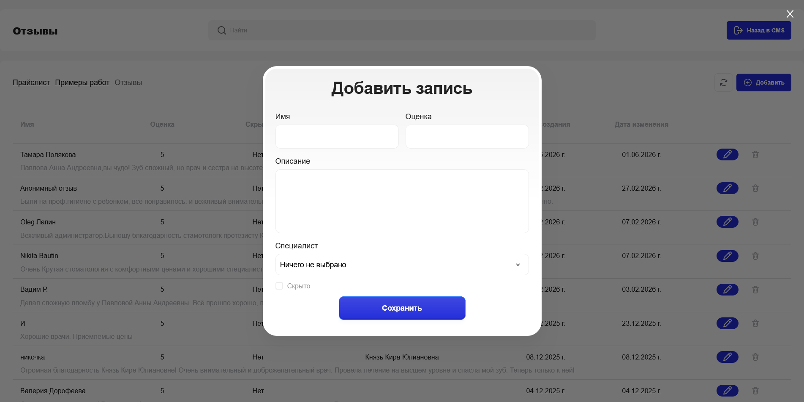

Модальное окно «Добавить запись» с полями: имя, оценка, описание, специалист (выпадающий список), чекбокс «Скрыто».

**Редактирование отзыва:**

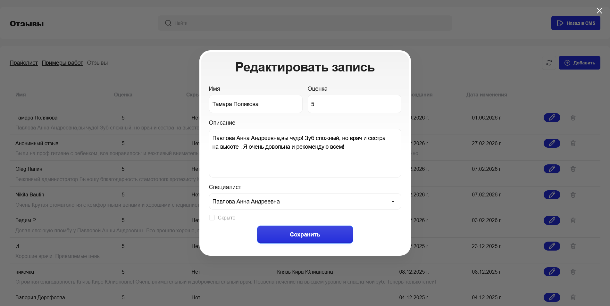

Модальное окно «Редактировать запись» с заполненными полями, включая текст отзыва и выбранного специалиста.

**Удаление отзыва:**

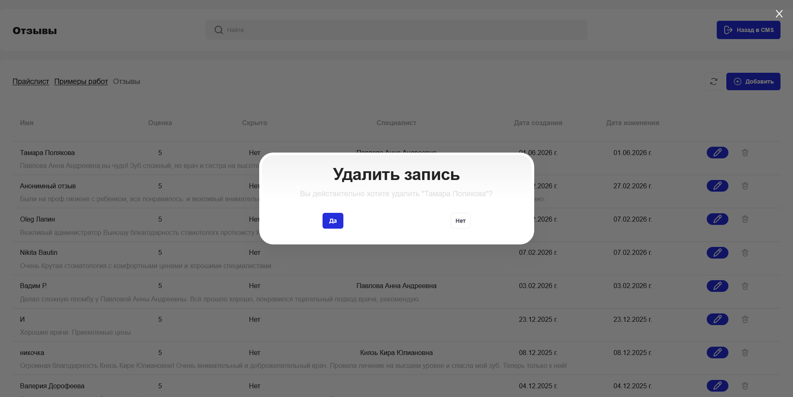

Модальное окно подтверждения: «Вы действительно хотите удалить "Тамара Полякова"?" с кнопками **Да** / **Нет**.

## Взаимодействие с API

Приложение работает с REST API бэкенда. Подробное описание контракта доступно в `docs/swagger.yaml`.

**Базовый URL:** определяется через `VITE_SITE_URL` (в dev-режиме проксируется Vite).

**HTTP-клиент:** нативный `fetch`, обёрнутый в `shared/api`.

**Используемые эндпоинты:**

| Раздел        | Метод   | Эндпоинт                     | Назначение                       |
|---------------|---------|------------------------------|----------------------------------|
| Прайс-лист    | `GET`   | `/api/pricelist`             | Список позиций с пагинацией      |
| Прайс-лист    | `POST`  | `/api/pricelist`             | Создание позиции                 |
| Прайс-лист    | `PATCH` | `/api/pricelist/{id}`        | Обновление позиции               |
| Прайс-лист    | `DELETE`| `/api/pricelist/{id}`        | Удаление позиции                 |
| Примеры работ | `GET`   | `/api/examples`              | Список примеров с пагинацией     |
| Примеры работ | `POST`  | `/api/examples`              | Создание примера                 |
| Примеры работ | `PATCH` | `/api/examples/{id}`         | Обновление примера               |
| Примеры работ | `DELETE`| `/api/examples/{id}`         | Удаление примера                 |
| Отзывы        | `GET`   | `/api/testimonials`          | Список отзывов с пагинацией      |
| Отзывы        | `POST`  | `/api/testimonials`          | Создание отзыва                  |
| Отзывы        | `PATCH` | `/api/testimonials/{id}`     | Обновление отзыва                |
| Отзывы        | `DELETE`| `/api/testimonials/{id}`     | Удаление отзыва                  |
| Галерея       | `GET`   | `/api/pictures`              | Список изображений для выбора    |
| Справочники   | `GET`   | `/api/team`                  | Список специалистов              |
| Справочники   | `GET`   | `/api/depts`                 | Список отделений                 |

**Аутентификация:**

Отдельной авторизации в приложении нет. Доступ возможен только при активной сессии MODX — если пользователь не залогинен, CMS возвращает 404 на маршрут `/app/...`. Все запросы отправляются с `credentials: 'include'` для передачи сессионной cookie.

При отсутствии прав на мутирующую операцию бэкенд возвращает:

```json
{
  "success": true,
  "data": { "success": false, "message": "Unauthorized" },
  "meta": {}
}
```

**Формат ответа:**

Все ответы обёрнуты в единую структуру:

```json
{
  "success": true,
  "data": {},
  "meta": {
    "total_time": "0.1314 s",
    "query_time": "0.0047 s",
    "php_time": "0.1267 s",
    "queries": 13,
    "source": "cache",
    "memory": "10 240 KB"
  }
}
```

Для списочных эндпоинтов используется двойная вложенность `data.data`:

```json
{
  "success": true,
  "data": {
    "data": {
      "page": 1,
      "perPage": 10,
      "totalCount": 39,
      "totalPages": 4,
      "data": [],
      "sortby": "updatedAt",
      "sortdir": "DESC",
      "search": null
    }
  },
  "meta": {}
}
```

## Особенности реализации

- **SPA без серверного рендеринга** — приложение полностью клиентское, роутинг через React Router.
- **Feature-Sliced Design** — архитектура построена по методологии FSD со слоями `app`, `pages`, `widgets`, `features`, `entities`, `shared`.
- **Кастомные CSS-модули** — UI-библиотеки не используются, все компоненты стилизуются через CSS-модули.
- **Zustand для состояния** — глобальное состояние (списки, выбранные записи, модалки) хранится в сторах Zustand.
- **Модальные окна для CRUD** — все операции создания, редактирования и удаления выполняются через модальные окна поверх таблицы (без перехода на отдельные страницы).
- **Обработка ошибок через тосты** — при ошибках API отображается всплывающее уведомление.
- **Без оптимистичных обновлений** — после сохранения данных выполняется повторный запрос к API для получения актуального списка.
- **Двойная вложенность `data.data`** — учитывается при парсинге ответов от бэкенда.
- **Флаг `is_hidden`** — отображается в таблицах как «Да» / «Нет», в формах — как чекбокс «Скрыто». Не является мягким удалением.
- **Флаг `isMinValue`** — отображается в прайс-листе как префикс «от» перед ценой. В форме — чекбокс «Минимальная цена».
- **Computed-поле `introtext`** — в примерах и отзывах заполняется бэкендом (ФИО специалиста), не редактируется через UI.
- **Выбор изображений из галереи** — при работе с примерами работ изображения «До» и «После» выбираются из общей галереи (`/api/pictures`), а не загружаются файлами.
- **Ссылки на сущности** — отделения и специалисты в таблицах являются ссылками на публичные страницы сайта.
- **Пагинация** — на всех списочных страницах, по 10 элементов на страницу (для галереи — по 20).
- **Поиск** — глобальное поле поиска в шапке, передаётся в API через параметр `search`.

## Сборка и деплой

**Production-сборка:**

```bash
npm run build
```

Результат сборки попадает в директорию `dist/` со следующей структурой (см. `vite.config.ts`):

```
dist/
└── template/
    ├── [name].[hash].js
    ├── [name].[hash].css
    └── [name].[hash].[ext]
```

**Base path:** в production (`VITE_APP_ENV=production`) используется `base: '/app'`, поэтому приложение доступно по адресу `http://sitename.com/app/...`.

**Деплой:** собранные файлы размещаются в MODX-проекте в директории `/app/`. Приложение работает как статика, взаимодействуя с API через относительные пути `/api/...`.

## Changelog

- **v0.0.0** — текущая версия:
  - Реализованы разделы «Прайс-лист», «Примеры работ», «Отзывы».
  - CRUD-операции через модальные окна.
  - Выбор изображений из галереи для примеров работ.
  - Пагинация, поиск, обновление данных.
  - Тосты / уведомления для обработки ошибок.
  - Архитектура по методологии Feature-Sliced Design.
  - Интеграция с ZoomX API.

## Лицензия

MIT
